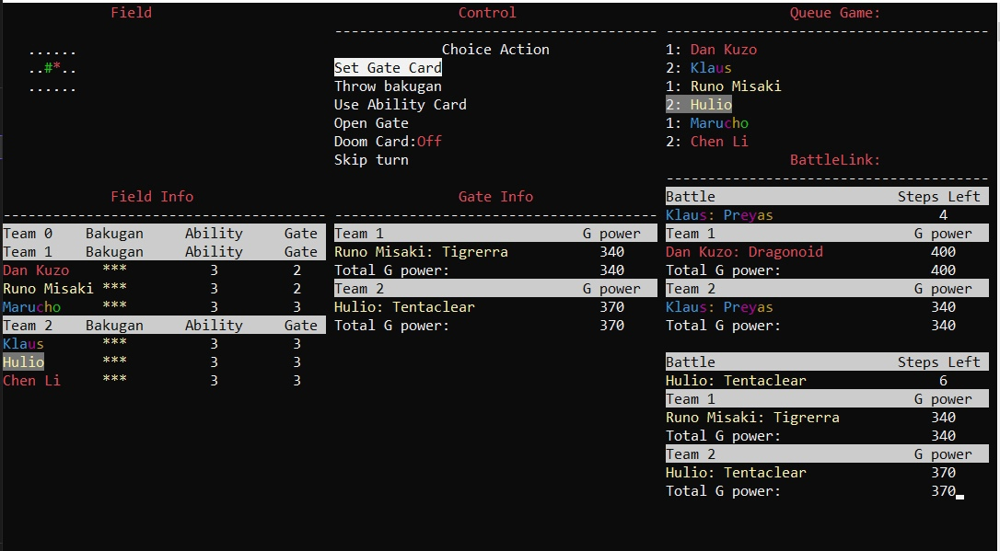

# BakuganGame

## About the project

The BakuganGame project is a fan-made game inspired by the combat mechanics of the first season of Bakugan. Our goal is to create game mechanics based on various algorithms and stacks of various technologies to develop programming skills for everyone. The project was created for scientific purposes only and has nothing to do with SpinMaster or the official Bakugan game. We are not trying to appropriate the intellectual work of SpinMaster, but only create a game inspired by this universe.

This is a console game written in the C# programming language. It has only been tested on the Windows operating system.

The game is a fighting simulator from the Bakugan anime series. There are two pointers in the game: the pointer to the gate card and the pointer to the selection menu. The field is controlled using the WASD keys, and the menu is controlled using the ARROWS, BACKSPACE and ENTER keys.

The goal of the game is to defeat the opposing team. The team with surviving Bakugan is declared the winner.

## Screenshots

